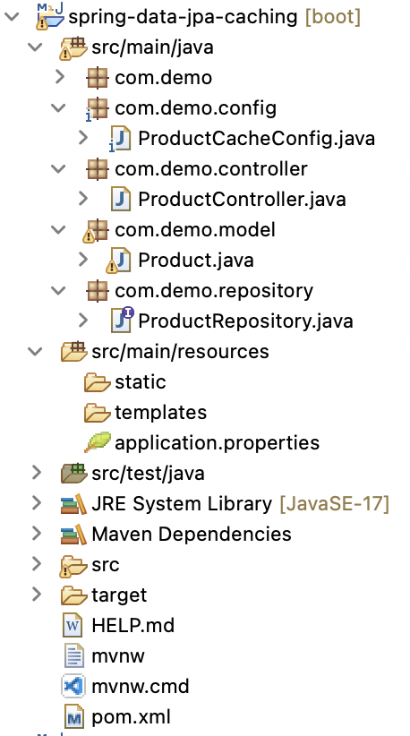

# spring-data-jpa-caching

To optimize application performance, in this project, I implemented **HazelCast Caching for Spring Data JPA**.


## Tools and Technologies Used

-   Spring Boot 3.2.2
-   JDK 17
-   Spring Framework 6.1.3
-   Maven 3.9
-   Spring Tool Suite4 (STS)
-   MySQL 8.0
-   Cache Provider: Hazelcast
-   Postman

## Project Structure



## API Endpoints

| Endpoint       | Method | Description                 |
| -------------- | ------ | --------------------------- |
| /products      | GET    | Get all products.           |
| /products/{id} | GET    | Get a single product by id. |
| /products      | POST   | Create a new product.       |
| /products/{id} | DELETE | Delete a product by id.     |
| /products/{id} | PUT    | Update a product by id.     |

## Cache Configuration

```
package com.demo.config;

import org.springframework.context.annotation.Bean;
import org.springframework.context.annotation.Configuration;

import com.hazelcast.config.Config;
import com.hazelcast.config.EvictionConfig;
import com.hazelcast.config.EvictionPolicy;
import com.hazelcast.config.MapConfig;
import com.hazelcast.config.MaxSizePolicy;

@Configuration
public class ProductCacheConfig {

	@Bean
	public Config createConfig() {
		return new Config().setInstanceName("hazel-instance")
				.addMapConfig(new MapConfig().setName("product-cache").setTimeToLiveSeconds(3000)
						.setEvictionConfig(new EvictionConfig().setSize(200)
								.setMaxSizePolicy(MaxSizePolicy.FREE_HEAP_SIZE).setEvictionPolicy(EvictionPolicy.LRU)));
	}
}
```

## @Cacheable: Triggers cache population

```
@Cacheable("product-cache")
@Transactional(readOnly = true)
@GetMapping("/products/{id}")
public Product getProduct(@PathVariable("id") int id) {
	System.out.println("Finding product by ID:"+id);
	return repository.findById(id).get();
}
```

## @CachePut: Updates the cache without interfering with the method execution

```
@CachePut(value = "product-cache", key="#id")
@PutMapping("/products/{id}")
public Product updateProduct(@RequestBody Product product, @PathVariable("id") int id) {
	return repository.save(product);
}
```

## @CacheEvict: Triggers cache eviction

```
@CacheEvict("product-cache")
@DeleteMapping("/products/{id}")
public void deleteProduct(@PathVariable("id") int id) {
	repository.deleteById(id);
}
```

## DEMO

The application is available at [http://localhost:8080](http://localhost:8080)

When you try to get a particular product by id for the first time, then it executes the service method and data is fetched from the **database**. For example, fetch the information of product 1 at http://localhost:8080/products/1


The observed SQL select query in STS console indicates the data is fetched from the database.


But if you try to fetch that product information **AGAIN**, then the results will be displayed very fast as this time the data is fetched from the **cache**. And **NO** log will be shown in the console since the data is not fetched from the database.


In addition, when the data is updated in the database, the already existed cache should be updated automatically as well. For example, when we update the the information of product 1 at http://localhost:8080/products/1 with PUT method.


The observed SQL select query in STS console indicates the data is successfully updated in the database.


This time when we use the GET method to get product 1, it will fetch the updated values from the **cache** since there is no log in the console.


